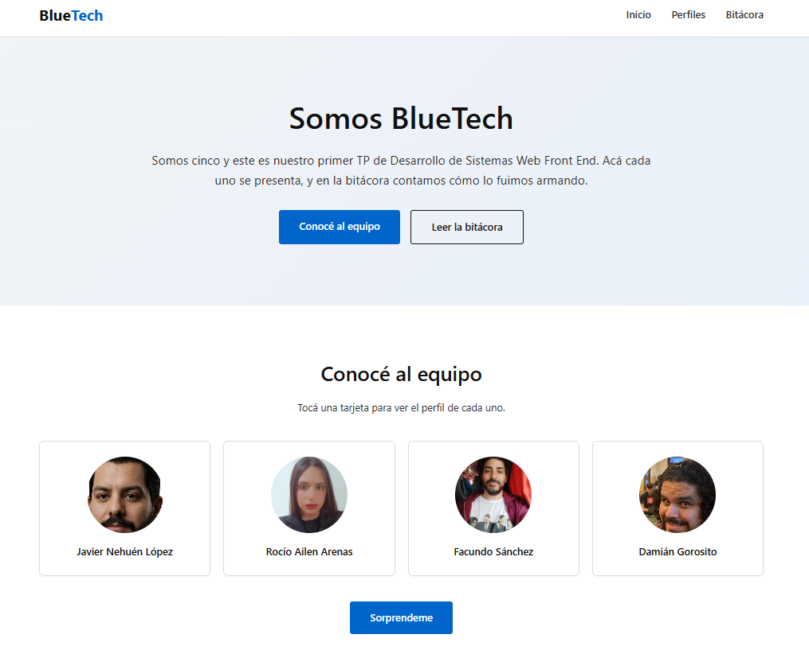
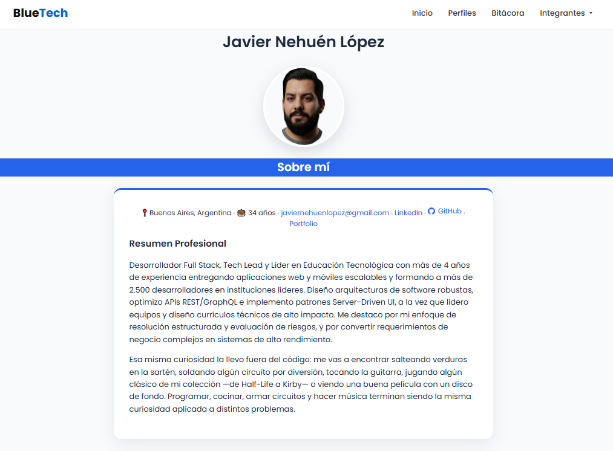
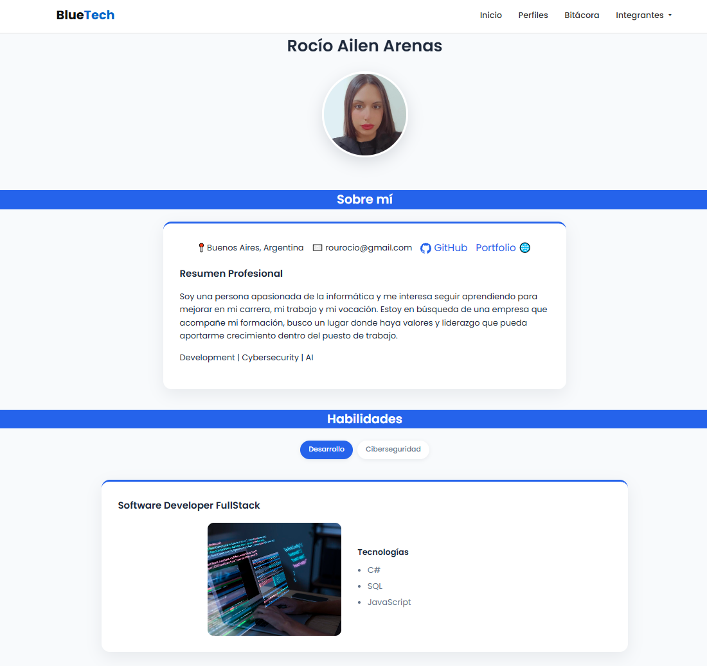
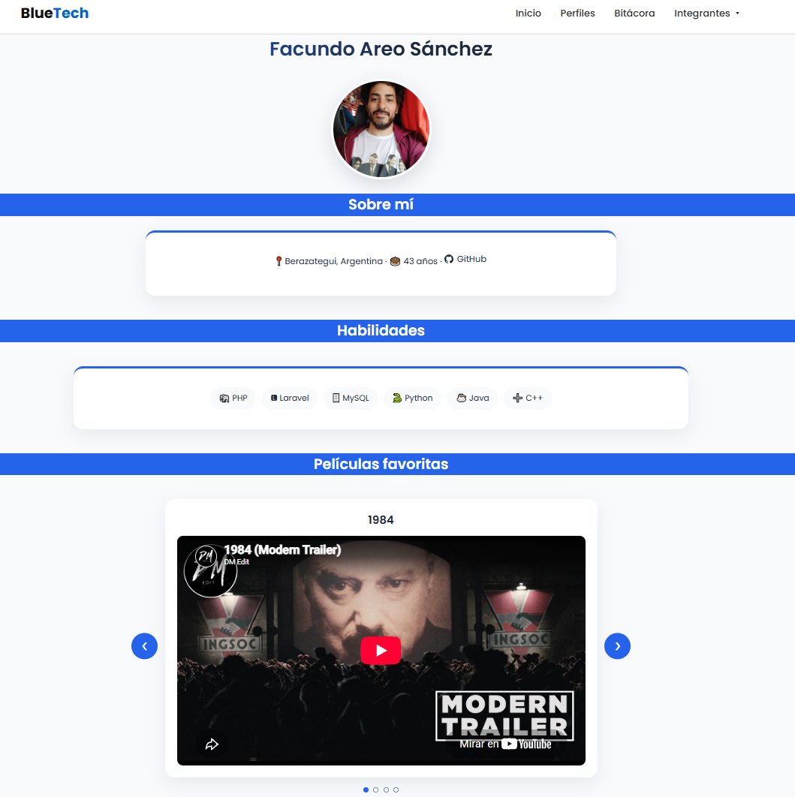
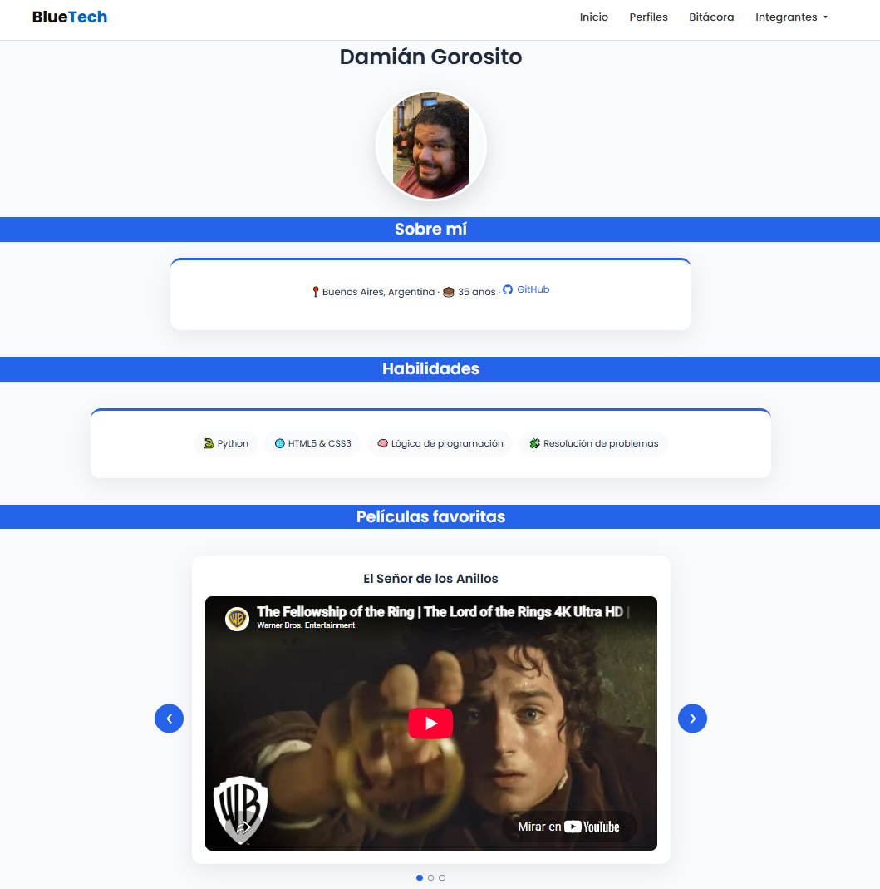

# BlueTech · TP1 Front End

Proyecto web en equipo hecho con HTML, CSS y JavaScript para la materia **Desarrollo de Sistemas Web Front End** (comisión 2C26, 2026).

Somos cuatro. El sitio tiene una portada, un perfil individual por integrante, navegación entre todas las páginas y una bitácora donde contamos cómo lo fuimos armando.

**Sitio publicado:** https://front-end-tp-1-gray.vercel.app/

## Integrantes

| Integrante | Perfil | GitHub |
|---|---|---|
| Javier Nehuén López | [perfil-2.html](perfil-2.html) | [Jableed43](https://github.com/Jableed43) |
| Rocío Ailen Arenas | [perfil-3.html](perfil-3.html) | [rocioailenar](https://github.com/rocioailenar) |
| Facundo Sánchez | [perfil-4.html](perfil-4.html) | [FacundoAreo](https://github.com/FacundoAreo)|
| Damián Gorosito | [perfil-5.html](perfil-5.html) | [damiangorosito](https://github.com/damiangorosito) |

> María Cristina Gutiérrez formó parte del equipo hasta el 22 de septiembre de 2026. Ver la nota en **Cambios en el equipo**, más abajo.

## Tecnologías

- HTML5 y CSS3 (Grid, Flexbox, variables CSS, media queries)
- JavaScript sin librerías
- Google Fonts (Poppins)
- Devicon (íconos de tecnologías, por CDN)
- Git y GitHub para el trabajo en equipo, con una rama por integrante

## Estructura

```
├── index.html            portada: presenta al equipo y lista los perfiles
├── bitacora.html         bitácora del proceso
├── perfil-2.html         Javier
├── perfil-3.html         Rocío
├── perfil-4.html         Facundo
├── perfil-5.html         Damián
├── perfil-template.html  plantilla base de los perfiles
├── css/
│   ├── style.css         variables y estilos base
│   ├── header-footer.css header y footer compartidos por todas las páginas
│   ├── perfil.css        estilos de los perfiles (carruseles, etiquetas, tarjetas)
│   ├── home.css          estilos exclusivos de la portada (hero, tarjetas, cta)
│   └── bitacora.css      estilos exclusivos de la bitácora (contenedor y tarjetas)
├── js/
│   ├── nav.js            dropdown "Integrantes" del header, en todas las páginas
│   ├── home.js           función de la portada
│   ├── perfil.js         filtros, carruseles y tarjetas de los perfiles
│   └── damian.js         script del perfil de Damián
├── img/                  avatares de cada integrante (una carpeta por persona) e íconos
└── context/              notas de diseño del proyecto
```

Los perfiles salen de `perfil-template.html`: mismo header, footer y estilos, y cada integrante completa sus datos.

## Guía de estilos

**Tipografía:** Poppins (Google Fonts), pesos 400, 500, 600 y 700.

**Paleta**

Perfiles:

| Uso | Color |
|---|---|
| Principal | `#2563EB` |
| Secundario | `#1E40AF` |
| Fondo | `#F8FAFC` |
| Superficie (tarjetas) | `#FFFFFF` |
| Texto | `#1E293B` |
| Texto secundario | `#64748B` |

Portada, header y footer:

| Uso | Color |
|---|---|
| Azul principal | `#0066CC` |
| Azul oscuro | `#004499` |
| Azul claro | `#E6F0FA` |
| Negro | `#111111` |
| Gris oscuro | `#333333` |
| Gris claro | `#F4F4F6` |
| Borde | `#DDDDDD` |

**Iconografía:** emojis para datos y etiquetas, Devicon para tecnologías y un ícono de GitHub en SVG (`img/icons/github.svg`).

## Funciones de JavaScript

| Dónde | Archivo | Qué hace |
|---|---|---|
| Todas las páginas | `js/nav.js` | El dropdown "Integrantes" del header se abre y cierra al hacer clic, y también con clic afuera o con Escape. |
| Portada | `js/home.js` | El botón **Sorprendeme** elige un integrante al azar y abre su perfil. |
| Perfil de Javier | `js/perfil.js` | Filtro de habilidades por categoría, carruseles de películas y discos, y tarjetas que se dan vuelta al hacer clic. |
| Perfil de Rocío | `js/perfil.js` | Filtro de habilidades (Desarrollo / Ciberseguridad) y carruseles de películas y canciones. |
| Perfiles con carrusel (Rocío, Facundo, Damián) | `js/perfil.js` | Carruseles de películas y discos con flechas y puntos. Al cambiar de slide se frena el video o el disco que estaba sonando. |
| Perfil de Damián | `js/damian.js` | Botón interactivo con animación, @keyframes sobre avatar y despliegue dinámico de mensaje. |

## Cómo verlo en local

Alcanza con abrir `index.html` en el navegador. Si preferís un servidor local:

```bash
python -m http.server 8000
```

y entrar a `http://localhost:8000`.

## Capturas de pantalla

**Portada**



**Perfiles**

<table>
  <tr>
    <td align="center">
      <br>
      Javier
    </td>
    <td align="center">
      <br>
      Rocío
    </td>
  </tr>
  <tr>
    <td align="center">
      <br>
      Facundo
    </td>
    <td align="center">
      <br>
      Damián
    </td>
  </tr>
</table>

## Cambios en el equipo

**María Cristina Gutiérrez** dejó el equipo el martes 22 de septiembre de 2026. Su mensaje al grupo:

> Hola, les aviso que finalmente me aprobaron la equivalencia, por lo que no voy a continuar cursando esta materia ni con el TP1 actual.

Por eso su perfil (`perfil-1.html`) ya no forma parte del sitio publicado. Su trabajo sigue disponible en el historial del repositorio.

## Uso de IA y Criterio de Autoría

En cumplimiento con el requisito transversal establecido en la consigna del TP1: el equipo ya contaba con conocimientos previos de maquetación y programación, y decidió cada componente y cada línea de diseño por su cuenta. La IA (ChatGPT, Claude y Gemini, con **planes gratuitos**) fue un acompañamiento puntual en el camino, no el punto de partida de las decisiones.

* **Dónde acompañó:**
  * **Estructura y CSS:** alguna consulta puntual sobre maquetación semántica en HTML5 y ajustes de layouts responsivos con CSS Grid y Flexbox.
  * **JavaScript:** una mano para revisar sintaxis y encontrar errores en la consola del navegador, sobre la lógica de interacciones (carruseles, tarjetas giratorias) que el equipo ya tenía pensada.
  * **Documentación:** ayuda para ordenar y dar formato en Markdown al `README.md`.
* **Imágenes:** no se usó IA para generar imágenes, logos ni avatares. Todos los recursos visuales son fotografías o avatares propios de los integrantes, y los íconos técnicos vienen directamente de la CDN de Devicon.
* **Revisión humana:** cada sugerencia se probó, se modificó y se entendió por completo antes de sumarla al repositorio. Las decisiones de diseño y la responsabilidad técnica del proyecto son del equipo.
